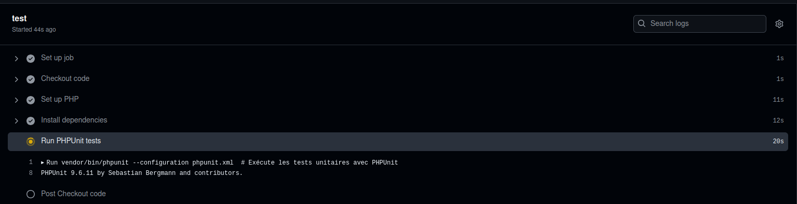
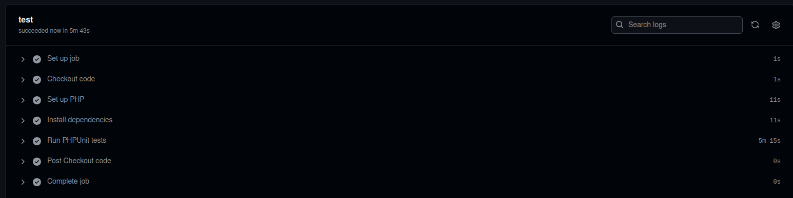
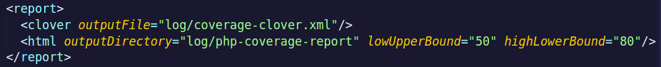
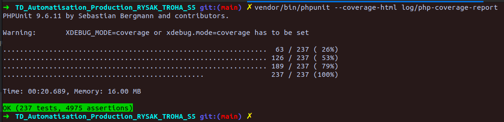
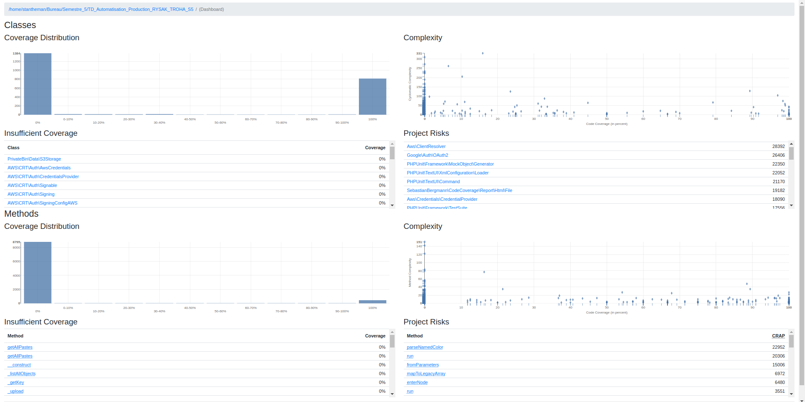
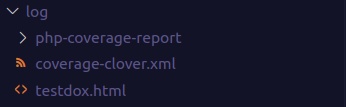

# Automatisation de la production

**RYSAK** Hugo --> hugo.rysak4@etu.univ-lorraine.fr  
**TROHA** Stanislas --> stanislas.troha8@etu.univ-lorraine.fr


## TD 1
Grâce au TD1, nous avons déjà pu comprendre le fonctionnement de php ainsi que de ses extensions (sqlite3, mbstring, gd). Nous avons également découvert phpunit qui permet de faire des tests unitaire contenus dans divers fichiers dans un dossier (tst).
Nouvelle commande utile découverte : `php -m` pour lister les extensions php en cours de fonctionnement.

L'utilisation de make peut rendre pratique l'installation de beaucoup de repository github, ce qui nous a donné l'idée d'intégrer un makefile à l'avenir. En définissant des champs du nom qu'on veut dans un makefile : 
```
install:
	bin/composer install

start:
	php -S localhost:8080

test:
	# cd tst && ../vendor/bin/phpunit
	./vendor/bin/phpunit tst
```
On peut simplement faire `make install`pour installer les dépendances de PrivateBin avec composer, `make start` pour lancer le serveur php, puis `make test` pour lancer les tests avec phpunit dans le dossier *tst*.

## TD 2
Nous avons découvert les actions avec les workflows github. 

Lors de chaque action faite par un utilisateur du repository github, on peut exécuter une ou plusieurs tâches (jobs) en lien avec cette dernière. Dans notre cas, on effectue des tests sur l'application grâce à **phpunit** après chaque requête *push*, ou *pull_request*.

On peut précisément définir l'action du workflow grâce à un fichier .yml qui doit être stocké dans le chemin ***.github/workflows/*** depuis la racine du repository.

Voici le notre, ***[ci.yml](.github/workflows/ci.yml)*** :
```yml
name: CI Tests # Ici on définit le nom du workflow

# Dans on, on peut choisir pour quelle type d'évènement les tâches définies dans la section jobs ci-dessous vont être déclenchées
on:
  push: # Lorsqu'un collaborateur du github fait un push sur la branche main. On peut ajouter autant de branches qu'on veut sur lesquelles les évènements doivent déclencher l'exécutuion des tâches.
    branches:
      - main
  pull_request: # Idem mais pour une pull_request sur la branche main.
    branches:
      - main

jobs: # On définit dans cette section les tâches à exécuter lorsque les évènements ci-dessus ont été déclenchés.
  test: # le nom de notre tâche à exécuter

    runs-on: ubuntu-latest  # On choisit d'utiliser un environnement Ubuntu car cela a fonctionné sur notre machine sous Ubuntu 22.04.4 LTS


    steps: # Puis les étapes différentes à faire pour exécuter correctement notre tâche, consistant en des tests
    - name: Checkout code
      uses: actions/checkout@v3  # On récupère le code source du repository grâce à une action github qui est prédéfinie

    - name: PHP Set up
      uses: shivammathur/setup-php@v2  # On utilise encore une action prédéfinie pour configurer php
      with: # Permet de passer des paramètres à l'action setup-php
        php-version: '8.1'  # Version de PHP qu'on utilise
        extensions: mbstring, sqlite3, gd, simplexml  # Extensions PHP nécessaires

    - name: Dependences
      run: | # permet d'exécuter une commande shell sur l'environnement ubuntu déployé.
        composer install  # Installe les dépendances via Composer

    - name: tests avec PHPUnit
      run: |
        vendor/bin/phpunit --configuration phpunit.xml  # Exécute les tests unitaires avec PHPUnit
```

Voici des captures d'écrans montrant la réalisation des tests : 





## TD 3 : Code Coverage

Nous avons découvert que pour les tests ou du code coverage, on peut spécifier via l'option `--configuration` le fichier de configuration [phpunit.xml](phpunit.xml). Grâce à ça, la partie concernée du fichier (`<coverage></coverage>` ou `<testsuite></testsuite>`) va être utilisée par phpunit pour run les tests ou le coverage du code.

#### Sur la machine

1) Tout d'abord, il est nécessaire d'installer l'extension php **xdebug**. On le fait via `sudo apt install php-xdebug`. On peut vérifier qu'elle est bien en cours avec `php -m | grep xdebug`
2) Une fois qu'elle est bien installée, on vérifie que le fichier **[phpunit.xml](phpunit.xml)** est configuré de sorte à pouvoir générer un rapport de couverture. 

Dans notre cas, il sera généré dans [log/php-coverage-report](log/php-coverage-report).
3) Ensuite, pour exécuter le code coverage sur notre machine, il suffit d'abord d'installer les dépendances via le [makefile](makefile) `make install`. 
Ensuite, lancer le serveur php avec `make start`.
Puis faire la commande : ```XDEBUG_MODE=coverage vendor/bin/phpunit --configuration phpunit.xml```. La commmande signifie : 
    - ***XDEBUG_MODE=coverage*** : On spécifie à l'extension xdebug de passer en mode coverage de code. Sinon on obtient un warning. On peut alternativement modifier le fichier php.ini sur sa machine mais ce n'est pas aussi pratique.


4) Puis, les résultats sous forme html sont disponibles dans [log/php-coverage-report](log/php-coverage-report/index.html) (qui n'est pas push sur le repository car ignoré). Les résultats sont disponibles dans ce répertoire suite à la configuration que l'on a faite à l'étape 3 dans [phpunit.xml](phpunit.xml) pour la balise `<html>` :

Comme nous avions spécifié également une balise `<clover>` dans [phpunit.xml](phpunit.xml), un fichier [coverage-clover.xml](log/coverage-clover.xml) a également été créé.
  

#### Sur github action

Nous avons découvert que lors des tests avec l'action phpunit, que ce soit en local sur notre machine ou avec les actions github, il est préférable d'utiliser le fichier de configuration [phpunit.xml](phpunit.xml).
