# Automatisation de la production

**RYSAK** Hugo --> hugo.rysak4@etu.univ-lorraine.fr  
**TROHA** Stanislas --> stanislas.troha8@etu.univ-lorraine.fr


## Table des matières
- [TD 1 - Introduction](#td-1---introduction)
- [TD 2 - Tests et Actions Github](#td-2---tests-et-action-github)
- [TD 3 - Code Coverage](#td-3---code-coverage)
- [TD 4 - Analyse Statique](#td-4---analyse-statique)
  - [PHPCS](#--phpcs-php-code-sniffer)
  - [PHPMD](#--phpmd-php-mess-detector)
  - [PHPSTAN](#--phpstan-php-static-analysis-tool-)
- [TD 5 - Déploiement Continu](#td-5---déploiement-continu)
- [Plus encore avec les Github Actions](#plus-encore-avec-les-github-actions)
_ _ _ 
## TD 1 - Introduction
Grâce au TD1, nous avons déjà pu comprendre le fonctionnement de php ainsi que de ses extensions (sqlite3, mbstring, gd). Nous avons également découvert phpunit qui permet de faire des tests unitaire contenus dans divers fichiers dans un dossier (tst).
Nouvelle commande utile découverte : `php -m` pour lister les extensions php en cours de fonctionnement.

L'utilisation de make peut rendre pratique l'installation de beaucoup de repository github, ce qui nous a donné l'idée d'intégrer un makefile à l'avenir. En définissant des champs du nom qu'on veut dans un makefile : 
```
install:
	bin/composer install

start:
	php -S localhost:8080

test:
	# cd tst && ../vendor/bin/phpunit
	./vendor/bin/phpunit tst
```
On peut simplement faire `make install`pour installer les dépendances de PrivateBin avec composer, `make start` pour lancer le serveur php, puis `make test` pour lancer les tests avec phpunit dans le dossier *tst*.

_ _ _ 

## TD 2 - Tests et Action Github
Nous avons découvert les actions avec les workflows github. 

Lors de chaque action faite par un utilisateur du repository github, on peut exécuter une ou plusieurs tâches (jobs) en lien avec cette dernière. Dans notre cas, on effectue des tests sur l'application grâce à **phpunit** après chaque requête *push*, ou *pull_request*.

On peut précisément définir l'action du workflow grâce à un fichier .yml qui doit être stocké dans le chemin ***.github/workflows/*** depuis la racine du repository.

Voici le notre, ***[ci.yml](.github/workflows/ci.yml)*** :
```yml
name: CI Tests # Ici on définit le nom du workflow

# Dans on, on peut choisir pour quelle type d'évènement les tâches définies dans la section jobs ci-dessous vont être déclenchées
on:
  push: # Lorsqu'un collaborateur du github fait un push sur la branche main. On peut ajouter autant de branches qu'on veut sur lesquelles les évènements doivent déclencher l'exécutuion des tâches.
    branches:
      - main
  pull_request: # Idem mais pour une pull_request sur la branche main.
    branches:
      - main

jobs: # On définit dans cette section les tâches à exécuter lorsque les évènements ci-dessus ont été déclenchés.
  test: # le nom de notre tâche à exécuter

    runs-on: ubuntu-latest  # On choisit d'utiliser un environnement Ubuntu car cela a fonctionné sur notre machine sous Ubuntu 22.04.4 LTS


    steps: # Puis les étapes différentes à faire pour exécuter correctement notre tâche, consistant en des tests
    - name: Checkout code
      uses: actions/checkout@v4  # On récupère le code source du repository grâce à une action github qui est prédéfinie

    - name: PHP Set up
      uses: shivammathur/setup-php@v2  # On utilise encore une action prédéfinie pour configurer php
      with: # Permet de passer des paramètres à l'action setup-php
        php-version: '8.1'  # Version de PHP qu'on utilise
        extensions: mbstring, sqlite3, gd, simplexml  # Extensions PHP nécessaires

    - name: Dependences
      run: | # permet d'exécuter une commande shell sur l'environnement ubuntu déployé.
        composer install  # Installe les dépendances via Composer

    - name: tests avec PHPUnit
      run: |
        vendor/bin/phpunit --configuration phpunit.xml  # Exécute les tests unitaires avec PHPUnit
```

Voici des captures d'écrans montrant la réalisation des tests : 


_ _ _ 

## TD 3 - Code Coverage

Nous avons découvert que pour les tests ou du code coverage, on peut spécifier via l'option `--configuration` le fichier de configuration [phpunit.xml](phpunit.xml). Grâce à ça, la partie concernée du fichier (`<coverage></coverage>` ou `<testsuite></testsuite>`) va être utilisée par phpunit pour run les tests ou le coverage du code.
D'ailleurs, la configuration de [phpunit.xml](phpunit.xml) importe. C'est dans ce fichier qu'on peut choisir les dossiers/fichiers qui sont testés pour le coverage et les tests. On peut définir les dossiers à tester avec la balise `<include>` : 
```xml
<include>
      <directory suffix=".php">./lib</directory>
</include>
```
A contrario, on peut choisir les fichiers/dossiers à exclure de la vérification qui sont contenus dans un dossier qui est testé grâce à la balise `<exclude>` : 
```xml
<exclude>
      <file>./lib/Data/AbstractData.php</file>
</exclude>
```

*Pour ce TD, la configuration du fichier [phpunit.xml](phpunit.xml) restera la même que ce soit pour le code coverage en local, ou avec github actions*.

#### En local sur la machine

1) Tout d'abord, il est nécessaire d'installer l'extension php **xdebug**. On le fait via `sudo apt install php-xdebug`. On peut vérifier qu'elle est bien en cours avec `php -m | grep xdebug`
2) Une fois qu'elle est bien installée, on vérifie que le fichier **[phpunit.xml](phpunit.xml)** est configuré de sorte à pouvoir générer un rapport de couverture. 
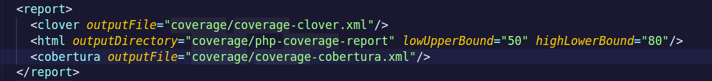
Dans notre cas, le rapport **HTML** sera généré dans `coverage/php-coverage-report`. Le rapport **COBERTURA** dans `coverage` sous le nom de `coverage-cobertura.xml`.
3) Ensuite, pour exécuter le code coverage sur notre machine, il suffit d'abord d'installer les dépendances via le [makefile](makefile) avec `make install`. Ensuite, lancer le serveur php avec `make start`. 
Puis faire la commande : ```XDEBUG_MODE=coverage vendor/bin/phpunit --configuration phpunit.xml```. La commmande signifie : 
    - ***XDEBUG_MODE=coverage*** : On spécifie à l'extension xdebug de passer en mode coverage de code. Sinon on obtient un warning. On peut alternativement modifier le fichier php.ini sur sa machine mais ce n'est pas aussi pratique.
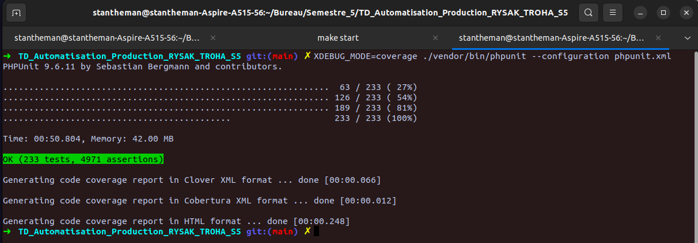

4) Puis, les résultats sous forme html sont disponibles dans `coverage/php-coverage-report/index.html` (qui n'est pas push sur le repository car ignoré). Les résultats sont disponibles dans ce répertoire suite à la configuration que l'on a faite à l'étape 2 dans [phpunit.xml](phpunit.xml) pour la balise `<html>` :

  

#### Sur github action

Pour github action, nous avons également utilisé le fichier [phpunit.xml](phpunit.xml). Voici le fichier de configuration [ci.yml](.github/workflows/ci.yml) (celui du TD précédent, modifié) qui permet de créer les rapports, puis de les afficher sur le summary github : 
```yaml
name: CI Tests  # Ici on définit le nom du workflow

# Dans on, on peut choisir pour quelle type d'évènement les tâches définies dans la section jobs ci-dessous vont être déclenchées
on:
  push: # Lorsqu'un collaborateur du github fait un push sur la branche main. On peut ajouter autant de branches qu'on veut sur lesquelles les évènements doivent déclencher l'exécutuion des tâches.
    branches:
      - main
  pull_request: # Idem mais pour une pull_request sur la branche main.
    branches:
      - main

jobs: # On définit dans cette section les tâches à exécuter lorsque les évènements ci-dessus ont été déclenchés.
  test: # le nom de notre tâche à exécuter
    runs-on: ubuntu-latest # On choisit d'utiliser un environnement Ubuntu car cela a fonctionné sur notre machine sous Ubuntu 22.04.4 LTS

    steps: # Puis les étapes différentes à faire pour exécuter correctement notre tâche, consistant en des tests
    - name: Checkout code
      uses: actions/checkout@v4 # On récupère le code source du repository grâce à une action github qui est prédéfinie

    - name: PHP Set up
      uses: shivammathur/setup-php@v2  # On utilise encore une action prédéfinie pour configurer php
      with: # Permet de passer des paramètres à l'action setup-php
        php-version: '8.1' # Version de PHP qu'on utilise
        extensions: mbstring, sqlite3, gd, simplexml, xdebug # Extensions PHP nécessaires

    - name: Dependences
      run: |  # permet d'exécuter une commande shell sur l'environnement ubuntu déployé.
        composer install  # Installe les dépendances via Composer

    - name: tests avec PHPUnit
      run: | # on lance les tests via phpunit et la configuration <testsuite> de phpunit.xml
        vendor/bin/phpunit --configuration phpunit.xml

    - name: coverage avec Xdebug
      run: | # on crée le dossier qui contiendra les rapports de coverage puis on lance phpunit en mode coverage avec XDEBUG
        mkdir -p coverage
        XDEBUG_MODE=coverage vendor/bin/phpunit --configuration phpunit.xml

    - name: ajout du rapport de couverture 
      uses: irongut/CodeCoverageSummary@v1.3.0 # action github qu'on utilise 
      with:
        filename: coverage/coverage-cobertura.xml
        badge: true
        format : markdown
        output : both

    - name : ajout du rapport au summary github
      run : |
        echo "## Résumé de la couverture de code" >> $GITHUB_STEP_SUMMARY
        cat code-coverage-results.md >> $GITHUB_STEP_SUMMARY

```


_ _ _ 

## TD 4 - Analyse statique

### - PHPCS (PHP Code Sniffer)

##### En local sur la machine

Tout d'abord, avant de pouvoir utiliser phpcs, on doit l'installer sur le projet à l'aide de composer : 
```bash
sudo apt install php-xmlwriter
composer require --dev "squizlabs/php_codesniffer=3.*"
```
On peut voir qu'avant d'ajouter phpcs au projet, il faut installer sur la machine l'extension php **xmlwriter** qui est une extension utilisée par phpcs.

Nous avons choisi de configurer phpcs à l'aide d'un fichier et non en ligne de commandes.
Pour ce faire, on doit créer un fichier du nom `.phpcs.xml`, `phpcs.xml`, `.phpcs.xml.dist`, ou `phpcs.xml.dist`. 
Nous avons choisi de l'appeler `phpcs.xml` et de le placer à la racine du projet.

[phpcs.xml](phpcs.xml) (commenté) : 
```xml
<?xml version="1.0"?>
<ruleset name="phpCS pour PrivateBin">
  <file>lib</file> <!-- Le dossier sur lequel on veut utiliser phpcs-->

  <!-- Ici on met les standards que l'on veut respecter -->
  <rule ref="PSR1"/>
  <rule ref="PSR2"/>
  <rule ref="PSR12"/>

    <!-- On spécifie l'extension des fichiers qu'on veut analyser-->
  <extensions>
    <extension name="php"/>
  </extensions>

  <!-- Coloration des rapports -->
  <arg name="colors"/>

  <!-- Pour avoir un rapport complet-->
  <arg name="report" value="full"/>

</ruleset>
```
Ensuite, il suffit de lancer **phpcs**`./vendor/bin/phpcs` depuis la racine du projet.
On obient :
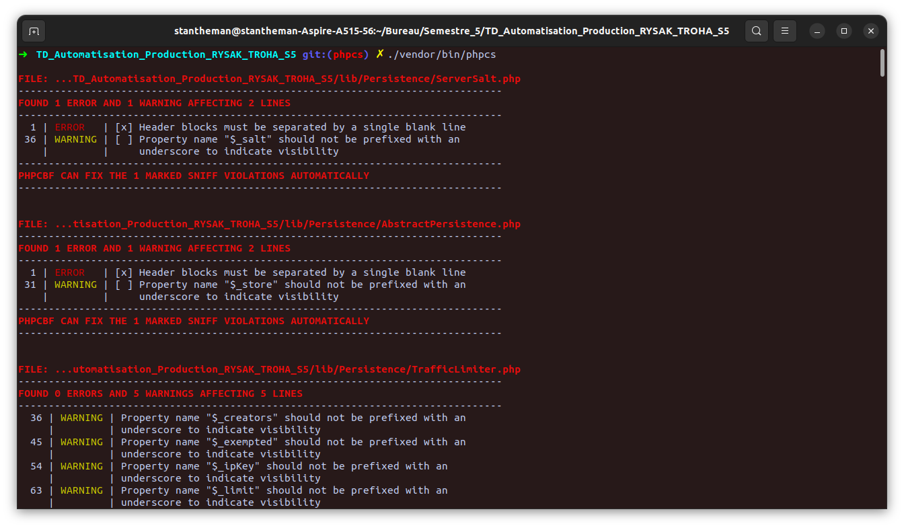
On voit donc chaque erreur et warning par fichier php situé dans [lib/](lib/). 


### - PHPMD (PHP Mess Detector)
##### En local sur la machine
Avant de pouvoir utiliser PHPMD, on doit l'ajouter au projet.
```bash
composer require --dev "phpmd/phpmd=@stable"
```

Identiquement à [phpcs](#--phpcs-php-code-sniffer), nous avons choisi de directement faire la configuration via un fichier plutôt que dans la ligne de commande. Il nous sera utile pour déployer **phpcs** sur les actions github.
Le fichier en question doit être nommé [ruleset.xml](ruleset.xml) :
```xml
<?xml version="1.0"?>
<?xml version="1.0"?>
<ruleset name="My first PHPMD rule set"
         xmlns="http://pmd.sf.net/ruleset/1.0.0"
         xmlns:xsi="http://www.w3.org/2001/XMLSchema-instance"
         xsi:schemaLocation="http://pmd.sf.net/ruleset/1.0.0
                     http://pmd.sf.net/ruleset_xml_schema.xsd"
         xsi:noNamespaceSchemaLocation="
                     http://pmd.sf.net/ruleset_xml_schema.xsd">
    <description>
        My custom rule set that checks my code...
    </description>
     <!-- Import the entire unused code rule set -->
    <rule ref="rulesets/unusedcode.xml" />

    <!-- Import the entire cyclomatic complexity rule -->
    <rule ref="rulesets/codesize.xml/CyclomaticComplexity" />
    
    <!-- Pareil pour règles de tailles -->
    <rule ref="rulesets/codesize.xml" />

    <!-- Et pour règles de nommage -->
    <rule ref="rulesets/naming.xml" />

    <!-- EvalExpression Rule qui est incluse dans controversial -->
    <rule ref="rulesets/controversial.xml" />
</ruleset>

```
Les règles importées sont celles données par l'exemple sur la doc de phpmd ainsi que celles présentes dans le cours.

Puis, pour lancer la détection : 
```bash
./vendor/bin/phpmd ./lib ansi ruleset.xml
```
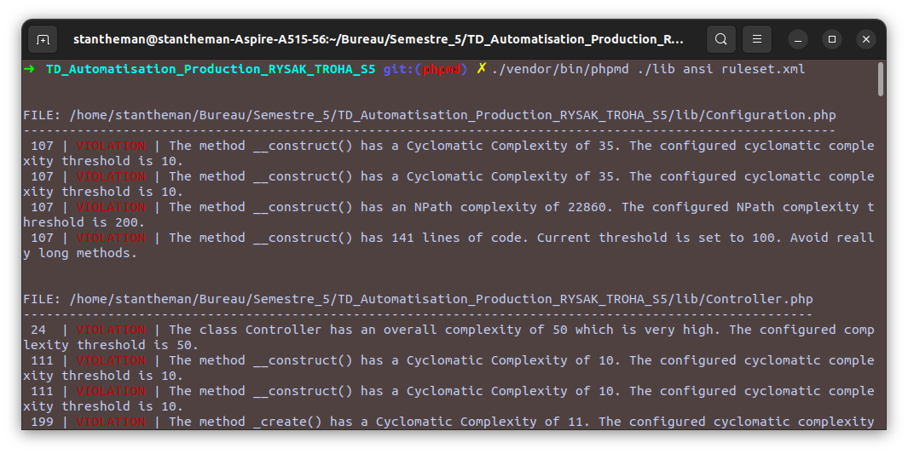
On obtient bien les règles qui sont violées pour chaque fichier php situé dans [.lib](lib/) (ex : conventions de nommage, complexité cyclomatique etc.).

### - PHPStan (PHP Static Analysis Tool )
##### En local sur la machine
Comme pour les deux outils précédents, on doit inclure **PHPStan** dans le projet à l'aide de composer : 
```bash
composer require --dev phpstan/phpstan
```
Nous avons encore décidé de créer un fichier [phpstan.neon](phpstan.neon) pour la configuration plutôt que de la faire en ligne de commmande. 
[phpstan.neon](phpstan.neon) : 
```neon
parameters:
  level: 5 # niveau d'analyse (de 0 a 9, 9 étant très strict)
  paths: # on inclue les dossiers à tester dont le code est écrit à la main (inutile de vérifier le vendor)
    - lib
    - tst
```

Il suffit maintenant de lancer la détection avec : 
```bash
./vendor/bin/phpstan analyse -c phpstan.neon
```

Voici divers exemples selon le niveau d'exigence spécifié dans [phpstan.neon](phpstan.neon) : 

##### Niveau 0 (le moins strict)
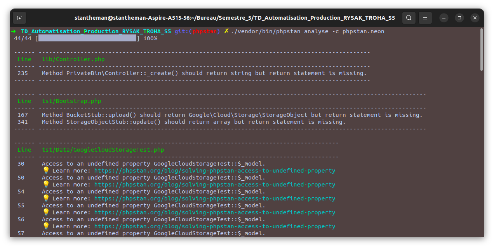
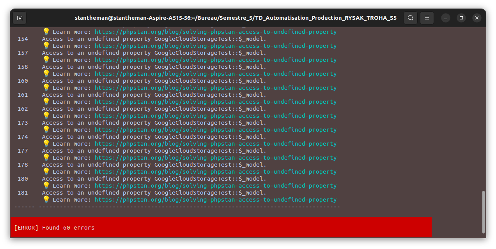
##### Niveau 5 (intermédiaire)
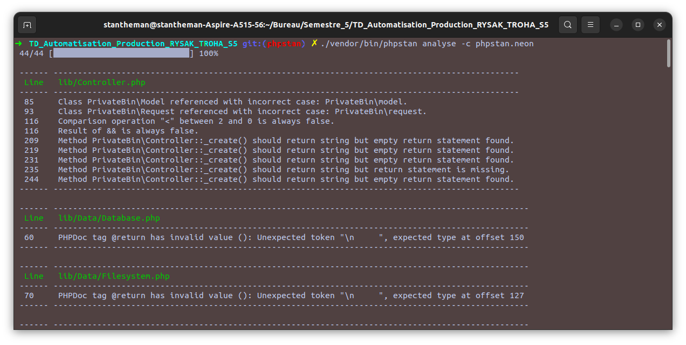
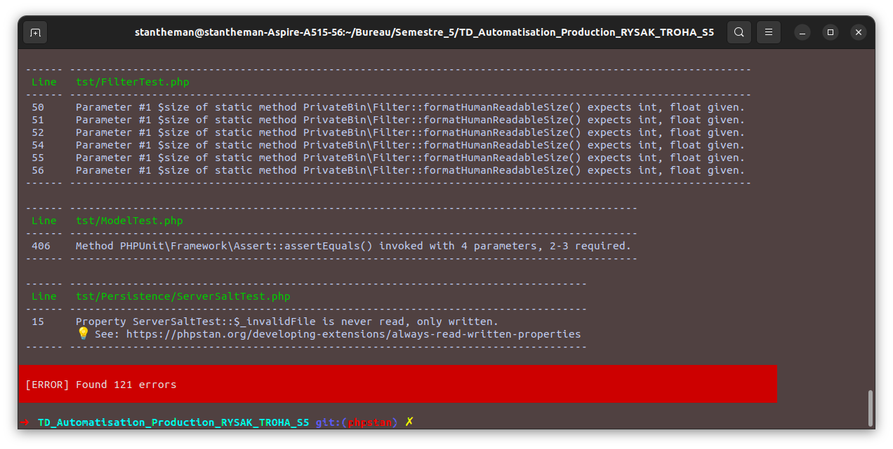
##### Niveau 9 (niveau maximal)
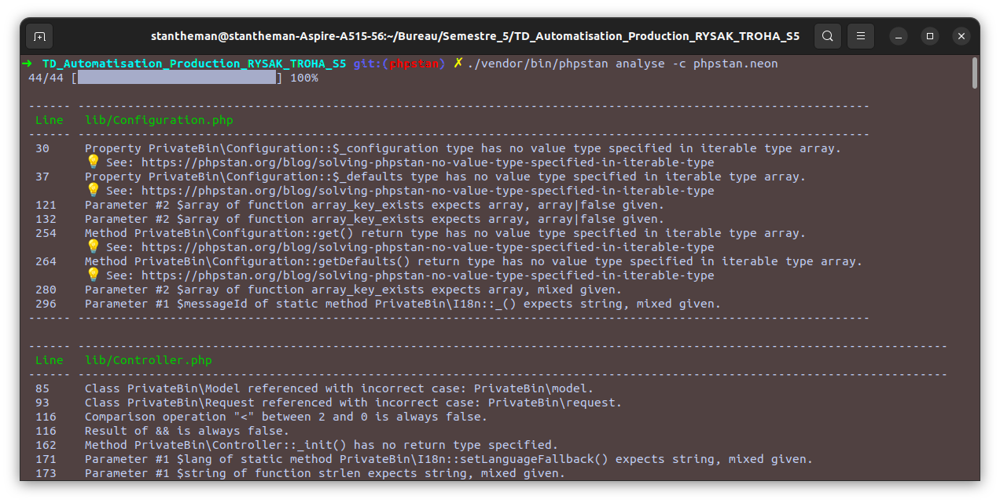
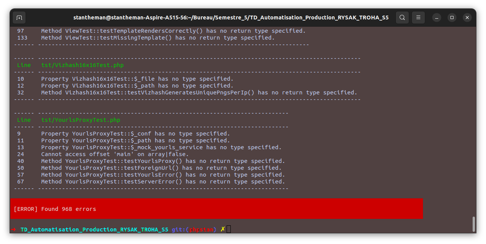

On peut constater une grosse différence du nombre d'erreurs trouvées selon le niveau d'exigence spécifié dans le fichier de configuration.


### Actions Github pour ces outils
Pour ces actions, il suffit de modifier le fichier [ci.yml](.github/workflows/ci.yml) en ajoutant trois nouvelles étapes (**steps**), correspondant respectivement aux trois outils (**phpcs, phpmd, phpstan**). Les étapes ont été insérées dans le même **job** utilisé jusqu'à présent.
```yml
    - name: PHP CodeSniffer
      run: |
        ./vendor/bin/phpcs --report=source > phpcs_report.txt || true
        echo "## PHP CodeSniffer Report" >> $GITHUB_STEP_SUMMARY
        echo '```' >> $GITHUB_STEP_SUMMARY
        cat phpcs_report.txt >> $GITHUB_STEP_SUMMARY
        echo '```' >> $GITHUB_STEP_SUMMARY


    - name: PHP Mess Detector
      run: |
        ./vendor/bin/phpmd ./lib github ansi ruleset.xml > phpmd_report.txt || true


    - name: PHPStan
      run: |
        ./vendor/bin/phpstan analyse -c phpstan.neon --error-format=github > phpstan_report.txt || true
```
Pour l'instant nous n'avons réussi qu'à ajouter la sortie de **PHPCS** au summary github car les formats de **phpstan** et **phpmd** ne conviennent pas et sont trop longs.
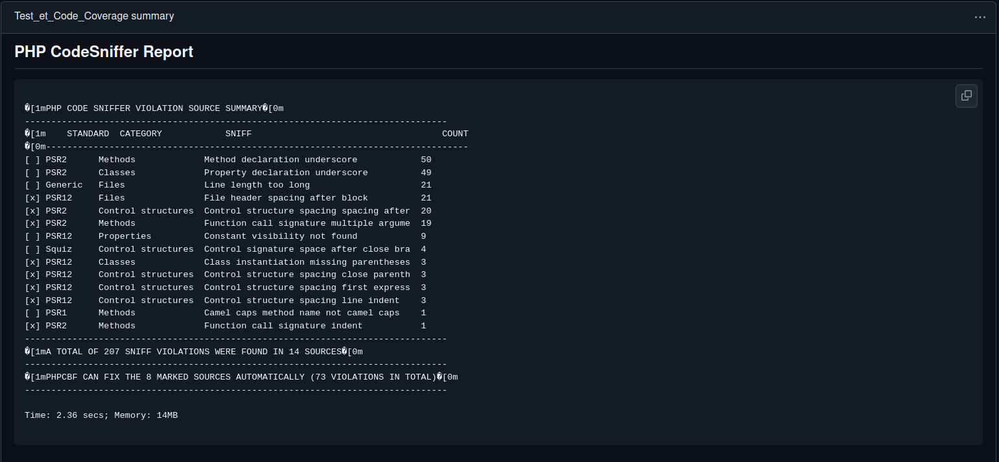

### Correction des erreurs détectées par outil

##### PHPCS
Les 5 erreurs corrigées proviennent du même fichier  :
<u>FILE</u>: *[lib/Data/S3Storage.php](lib/Data/S3Storage.php)*
```bash
FOUND 5 ERRORS AND 5 WARNINGS AFFECTING 10 LINES
--------------------------------------------------------------------------------------------------------------------
   1 | ERROR   | [x] Header blocks must be separated by a single blank line
  50 | WARNING | [ ] Property name "$_client" should not be prefixed with an underscore to indicate visibility
  58 | WARNING | [ ] Property name "$_options" should not be prefixed with an underscore to indicate visibility
  66 | WARNING | [ ] Property name "$_bucket" should not be prefixed with an underscore to indicate visibility
  74 | WARNING | [ ] Property name "$_prefix" should not be prefixed with an underscore to indicate visibility
 103 | WARNING | [ ] Line exceeds 120 characters; contains 130 characters
 122 | ERROR   | [ ] Method name "_listAllObjects" must not be prefixed with an underscore to indicate visibility
 149 | ERROR   | [ ] Method name "_getKey" must not be prefixed with an underscore to indicate visibility
 167 | ERROR   | [ ] Method name "_upload" must not be prefixed with an underscore to indicate visibility
 418 | ERROR   | [ ] Method name "_getExpiredPastes" must not be prefixed with an underscore to indicate visibility
--------------------------------------------------------------------------------------------------------------------
```
Une fois les erreurs et warnings corrigés, [lib/Data/S3Storage.php](lib/Data/S3Storage.php) n'apparaît plus dans la sortie de **phpcs** :
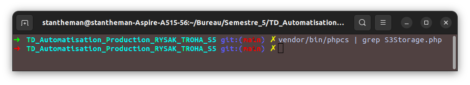


##### PHPMD
3 violations proviennent du même fichier :
<u>FILE</u>: [lib/YourlsProxy.php](lib/YourlsProxy.php)
```bash
--------------------------------------------------------------------------------------------------------
 23  | VIOLATION | The property $_error is not named in camelCase.
 23  | VIOLATION | The property $_url is not named in camelCase.
 56  | VIOLATION | The variable $yourls_api_url is not named in camelCase.
```

Une autre violation provient de :
<u>FILE</u>: [lib/View.php](lib/View.php)
```bash
-------------------------------------------------------------------------------------------------
 22  | VIOLATION | The property $_variables is not named in camelCase.
```

La dernière violation provient de : 
<u>FILE</u>: [lib/Filter.php](lib/Filter.php)
```bash
---------------------------------------------------------------------------------------------------
 64  | VIOLATION | Avoid variables with short names like $i. Configured minimum length is 3.
``` 

Une fois ces modifications faites, on constate qu'il n'y a plus aucune violation, ni dans [lib/YourlsProxy.php](lib/YourlsProxy.php) ni dans [lib/View.php](lib/View.php) ou encore [lib/Filter.php](lib/Filter.php) puisque les classes n'apparaissent plus dans la sortie de **phpmd** :
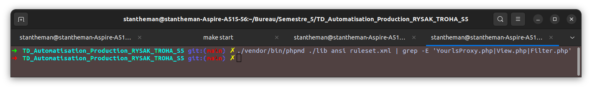


##### PHPSTAN
1.
``` bash
 ------ ------------------------------------------------------------------------------------------ 
  Line   lib/Model.php                                                                             
 ------ ------------------------------------------------------------------------------------------ 
  44     Class PrivateBin\Configuration referenced with incorrect case: PrivateBin\configuration.  
 ------ ------------------------------------------------------------------------------------------
```

2.
```bash
 ------ -------------------------------------------------------------------------------------------------- 
  Line   lib/Data/Database.php                                                                             
 ------ -------------------------------------------------------------------------------------------------- 
  60     PHPDoc tag @return has invalid value (): Unexpected token "\n     ", expected type at offset 150  
 ------ --------------------------------------------------------------------------------------------------
```


3.
```bash
 ------ -------------------------------------------------------------------------------------------------- 
  Line   lib/Data/Filesystem.php                                                                           
 ------ -------------------------------------------------------------------------------------------------- 
  70     PHPDoc tag @return has invalid value (): Unexpected token "\n     ", expected type at offset 127  
 ------ --------------------------------------------------------------------------------------------------
```

4. 
```bash
 ------ -------------------------------------------------------------------------------------------------- 
  Line   lib/Data/GoogleCloudStorage.php                                                                   
 ------ -------------------------------------------------------------------------------------------------- 
  52     PHPDoc tag @return has invalid value (): Unexpected token "\n     ", expected type at offset 138  
 ------ --------------------------------------------------------------------------------------------------
```

5.
```bash
 ------ --------------------------------------------------------------------------------------------------------- 
  Line   lib/Filter.php                                                                                           
 ------ --------------------------------------------------------------------------------------------------------- 
  50     Parameter #1 $messageId of static method PrivateBin\I18n::_() expects string, array<int, string> given.  
 ------ --------------------------------------------------------------------------------------------------------- 
```

Une fois ces 5 erreurs résolues, on peut voir que les noms des classes concernées n'apparaîssent plus dans la sortie de **phpstan**, ce qui veut dire qu'elles sont bien corrigées : 
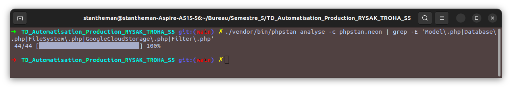

#### Bonus : Résolution du package aws entraînant une exposition à un attaque de sécurité.
Après un `composer audit` on obtient :  
```bash
Found 1 security vulnerability advisory affecting 1 package:
+-------------------+----------------------------------------------------------------------------------+
| Package           | aws/aws-sdk-php                                                                  |
| Severity          | medium                                                                           |
| CVE               | CVE-2023-51651                                                                   |
| Title             | Potential URI resolution path traversal in the AWS SDK for PHP                   |
| URL               | https://nvd.nist.gov/vuln/detail/CVE-2023-51651                                  |
| Affected versions | >=3.0.0,<3.288.1                                                                 |
| Reported at       | 2023-11-22T00:00:00+00:00                                                        |
+-------------------+----------------------------------------------------------------------------------+
Found 1 abandoned package:
+-------------------+----------------------------------------------------------------------------------+
| Abandoned Package | Suggested Replacement                                                            |
+-------------------+----------------------------------------------------------------------------------+
| yzalis/identicon  | none                                                                             |
+-------------------+----------------------------------------------------------------------------------+
```
On peut voir que la CVE concerne les versions comprises entre la **3.0.0** et la **3.288.1**. Or, pour ce projet, la version **3.254.0** est utilisée, elle est donc concernée. Cela rend l'application vulnérable.
Pour résoudre ce problème, il suffit de passer à une version qui n'est pas concernée par cette CVE :
```bash
composer require aws/aws-sdk-php:^3.288.1
```
Maintenant, avec un `composer audit`, aucun problème de sécurité n'est détecté (et tous les outils utilisés jusqu'à présent donnent les mêmes résultats): 
```bash
No security vulnerability advisories found.
Found 1 abandoned package:
+-------------------+----------------------------------------------------------------------------------+
| Abandoned Package | Suggested Replacement                                                            |
+-------------------+----------------------------------------------------------------------------------+
| yzalis/identicon  | none                                                                             |
+-------------------+----------------------------------------------------------------------------------+
```
Seul un package est détecté comme obsolète (il n'est plus supporté), mais s'il est dans le projet c'est qu'il doit être utile donc nous ne nous en occuperons pas.


## TD 5 - Déploiement continu
Pour commmencer, nous avons créé 3 secrets dans le dépôt correspondants à l'URL du serveur **FTP**, le **LOGIN** de notre groupe ainsi que notre **MOT DE PASSE**: 
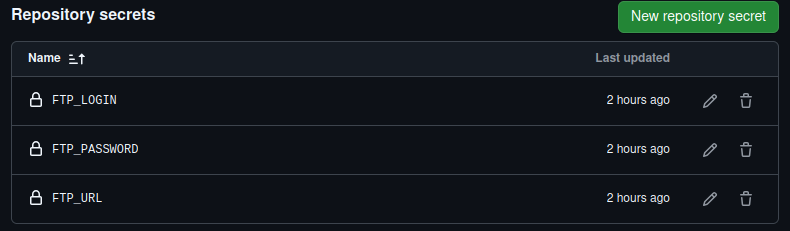

Puis nous avons ajouté l'action [FTP Deploy](https://github.com/marketplace/actions/ftp-deploy) au fichier [ci.yml](.github/workflows/ci.yml) tout à la fin du fichier, en tant que dernière **étape**. Ainsi, une fois que toutes les validations sont faites (tests, analyse statique, code coverage), le déploiement peut être effectué sur l'environnement de pré production.

<u>[ci.yml](.github/workflows/ci.yml) (commenté)</u> :
```yml
- name : Deploiement du projet 
      uses : SamKirkland/FTP-Deploy-Action@v4.3.5
      with : 
       # on récupère les secrets github que l'on vient de créer
        server : ${{secrets.FTP_URL}}
        username : ${{secrets.FTP_LOGIN}}
        password : ${{secrets.FTP_PASSWORD}}
        local-dir : ./ # le dossier que l'on veut uploader sur le serveur ftp, en l'occurence tout le repository github, à l'exception de certains dossiers et fichiers
        exclude : | # ici, on déclare tous les fichiers que le l'on ne veut pas uploader sur le serveur ftp
          **/.git*/**
          **/vendor/**
          **/bin/**
          **log/**
          **/coverage/**
          **/tst/**
          **phpstan.neon**
          **ruleset.xml**
          **/ressources/**   
          **code-coverage-results.md**
          **phpcs.xml**
          **phpcs_report.txt**
          **phpmd_report.txt**
          **phpstan_report.txt**
          **README.md**
          **phpunit.xml**
        server-dir : www/ # on précise ici le répetoire dans lequel on veut uploader nos fichiers sur le serveur ftp
```

On peut ensuite vérifier que le serveur ftp comporte les fichiers qui ont été uploadés par l'action : 
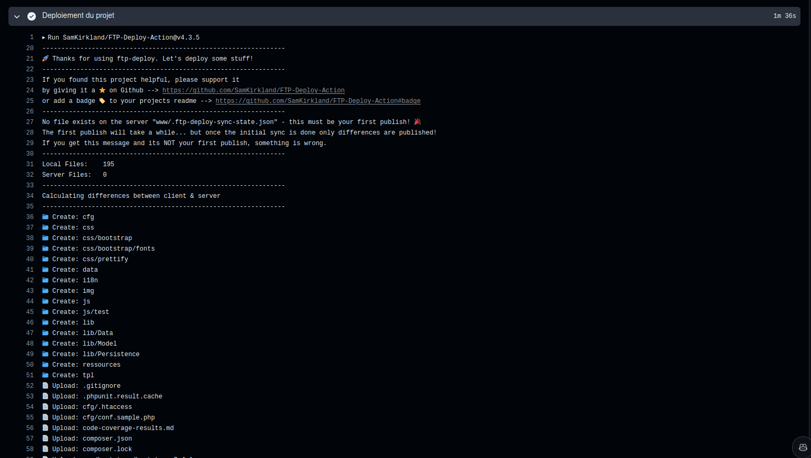
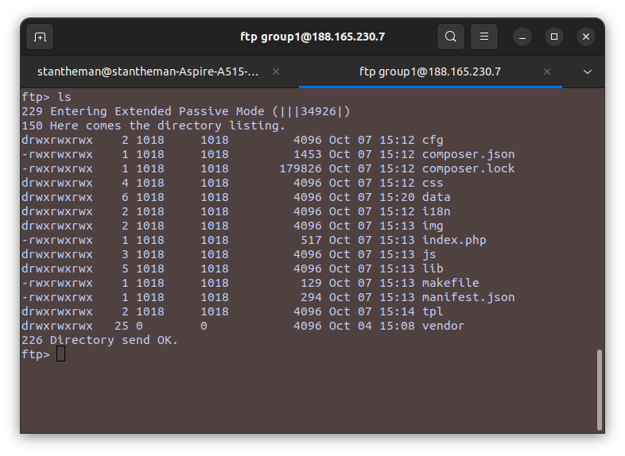

Ainsi, on peut se rendre sur [group1.bleumatin.fr](https://group1.bleumatin.fr) :  
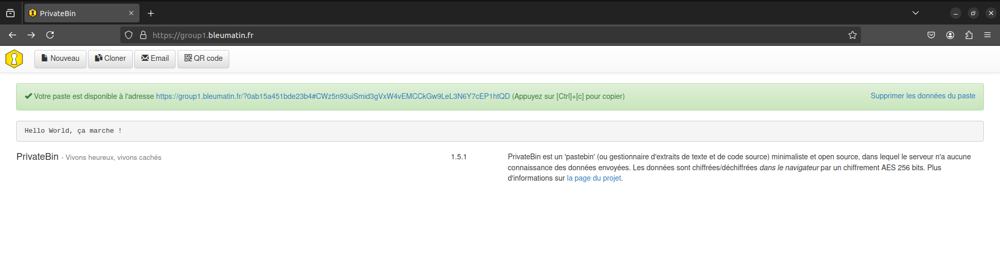

## Plus encore avec les github actions
Pour commencer, il y a plusieurs façons de faire des actions github. Nous avons choisi d'en faire une en [JavaScript](https://docs.github.com/en/actions/sharing-automations/creating-actions/creating-a-javascript-action) étant donné que c'est un langage auquel nous sommes familiers, et que la gestion de paquets avec node est plutôt intuitive.

Nous avons décidé de créer une action permettant de notifier sur discord, via un webhook, le résultat de l'exécution d'un worfklow. (Dans notre cas, lors de chaque push ou pull request sur la branche main). 
C'est à dire que l'action (qui est un job à part entière) va récupérer en entrée la sortie d'exécution du job précédent (Test_et_Code_Coverage_DeploiementFTP dans notre cas) et l'afficher sous forme de message embedded sur discord.

Pour commencer, il fallait créer un webhook sur discord dans un salon et un serveur dédiés, puis ajouter son URL dans les secrets du repository :
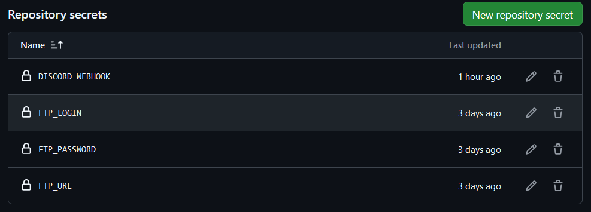 


 
Il a fallu ensuite ajouter un deuxième job dans notre fichier [ci.yml](.github/workflows/ci.yml) :
```yml
 notifier-discord: # Nouveau job qui informe sur le résultat du job qui s'occupe du code coverage tests, etc.
    runs-on: ubuntu-latest
    needs: Test_et_Code_Coverage_DeploiementFTP
    if: always()
    steps:
      - name: Checkout code # On récupère le code comme pour chaque job
        uses: actions/checkout@v4

      - name: Set up Node.js # L'action est faite en javascript, donc on a besoin de node pour la lancer
        uses: actions/setup-node@v2
        with:
          node-version: "20"

      - name: Install dependencies # on a besoin de npm pour installer toutes les dépendances (axios et les fonction @core de github toolkit)
        run: npm install
        working-directory: ./.github/actions/discord-output

      - name: Résultats des tests, code coverage et déploiement sur le serveur FTP via Discord
        uses: ./.github/actions/discord-output
        with:
          discord_webhook: ${{ secrets.DISCORD_WEBHOOK }}
          test_status: ${{ needs.Test_et_Code_Coverage_DeploiementFTP.result }}
          job_name: Test_et_Code_Coverage_DeploiementFTP # Ici on met le nom du job précédent plutot que le définir dans index.js
```
> **needs** permet de définir le fait d'attendre la fin de l'exécution du premier job pour commencer celui-là. C'est nécessaire d'attendre, pour que le webhook puisse afficher le résultat du job précédent(exécuté sans erreurs, avec, etc.)  
> **if: always()** permet de faire en sorte que ce job ne soit pas abandonné si jamais le précédent échoue.


Puis, il fallait définir un fichier [action.yml](.github/actions/discord-output/action.yml) qui fait le lien entre [ci.yml](.github/workflows/ci.yml) et notre code JavaScript chargé d'envoyer le message sur discord : 
```yml
name: "Output d'un worfklow sur discord"
description: "Envoie sous forme de message embedded les résultats d'exécution d'un worfklow. Ceci via un webhook"
inputs: # On définit les inputs. c'est à dire, les informations données dans le with: lorsque le fichier de worfklow utilise cette action
  discord_webhook:
    description: "URL du webhook discord"
    required: true
  test_status:
    description: "Status du job précédent"
    required: true
  job_name:
    description: "Nom du job dont le webhook discord doit notifier"
    required: true

runs:
  using: "node20"
  main: "dist/index.js"
```
> Le champ **inputs** correspond aux entrées qui vont être données au programme JavaScript. Par exemple, le programme aura besoin du lien du webhook pour savoir où envoyer les informations, mais aussi de savoir si le job précédent a été un succès ou un échec, et également le nom de ce dernier.


Pour finir, il a fallu écrire le contenu de l'index.js contenant la logique pour notifier sur discord : 
```js
const core = require('@actions/core');
const axios = require('axios');

async function run() {
  try {
    // On récupère les inputs du worfklow ci.yml
    const discordWebhook = core.getInput('discord_webhook');
    const testStatus = core.getInput('test_status');
    const jobName = core.getInput('job_name');

    // Au cas où quelqu'un utilise l'action et ne spécifie pas l'url du webhook dans les inputs
    if (!discordWebhook) {
      throw new Error('Il faut donner un webhook discord en entrée dans votre workflow !');
    }

    // On construit le message que le webhook va afficher
    const statusEmoji = testStatus === 'success' ? ':green_square:' : ':red_square:'; //si le job du worflow a fonctionné ou pas
    const nomWorkflow = process.env.GITHUB_WORKFLOW;
    const embedMessage = { 
      username: 'Github Actions AUTOMATISATION DE LA PRODUCTION',
      avatar_url: 'https://ipfs.io/ipfs/QmcoYqrddqLcfDa2q6iA4X2i4FMAjEAEGNPxSi1oNWjfCZ/nft.jpg',
      embeds: [
        {
          title: `🚀 WORKFLOW : **${nomWorkflow}**`,
          description: `**Job:** *${jobName}*\n**Status:** ${statusEmoji} ${testStatus.charAt(0).toUpperCase() + testStatus.slice(1)}\n\n:sparkles: Le workflow s'est bien complété ! :sparkles:`,
          color: testStatus === 'success' ? 3066993 : 15158332,  // Vert si succès, rouge sinon
          fields: [
            { 
              name: '📂 **Repository**', 
              value: `\`\`\`${process.env.GITHUB_REPOSITORY}\`\`\``, // Encadré de texte en bloc
              inline: false 
            },
            { 
              name: '🌿 **Branche**', 
              value: `\`${process.env.GITHUB_REF_NAME}\``, // Texte encadré dans des backticks
              inline: true 
            },
            { 
              name: '⚙️ **Workflow**', 
              value: `\`${process.env.GITHUB_WORKFLOW}\``, 
              inline: true 
            },
            { 
              name: '💼 **Job**', 
              value: `\`${jobName}\``, 
              inline: false 
            }
          ],
          footer: {
            text: 'Workflow complété ',
            icon_url: 'https://encrypted-tbn0.gstatic.com/images?q=tbn:ANd9GcSmrGmeBv3SOLSKz6OlTVlVYkfH9_W3BBgdrA&s'
          },
          timestamp: new Date().toISOString()
        }
      ]
    };

    // Et avec axios on poste le message via l'url du webhook et ce qu'on a construit
    await axios.post(discordWebhook, embedMessage);

    core.info('Notification discord bien envoyée !');
  } catch (error) {
    core.setFailed(`Problème dans l'envoi de la notification: ${error.message}`);
  }
}
run();
```
> On utilise [axios](https://axios-http.com/docs/intro) pour effectuer la requête à l'URL du webhook discord.  
> Grâce à **@action/core** du [toolkit](https://github.com/actions/toolkit) proposé par Github, on peut facilement récupérer les inputs (webhook discord, succès/échec du job) et gérer les outputs.


Grâce à ça, lors de chaque push ou pull request sur le repository sur la branche main, le nouveau job est exécuté et notifie sur discord.

- Par exemple, si le job de test coverage, tests et déploiement sur le serveur FTP rencontre une erreur, le message ressemble à ça : 
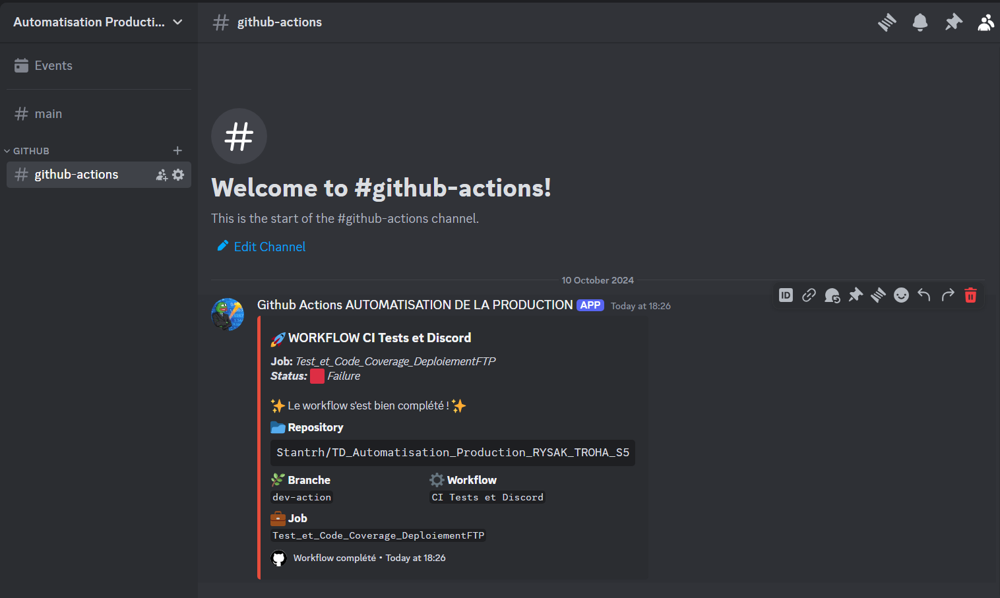

- Et si le job s'exécute sans problème, on obtient ce message :
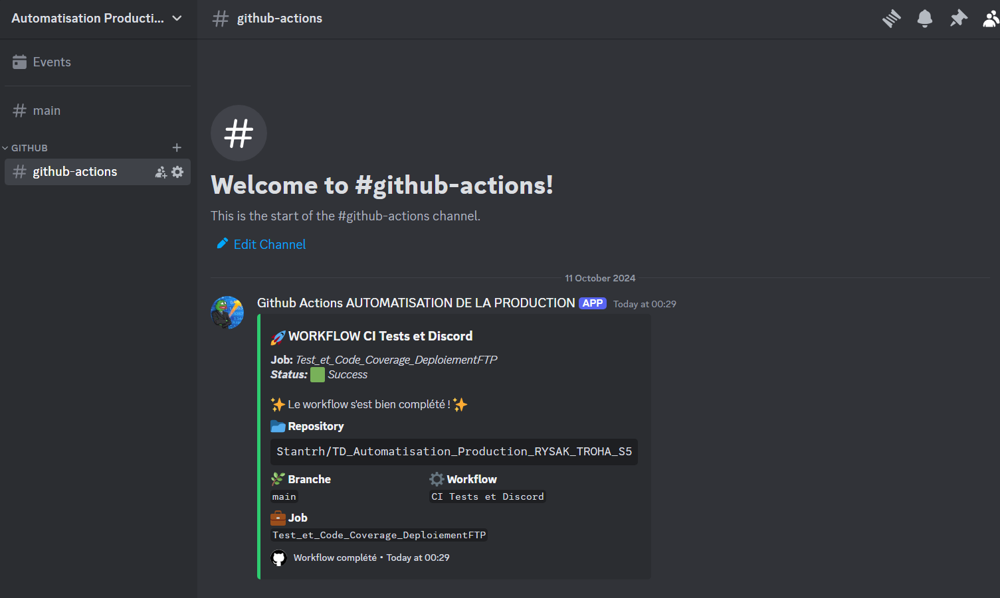

